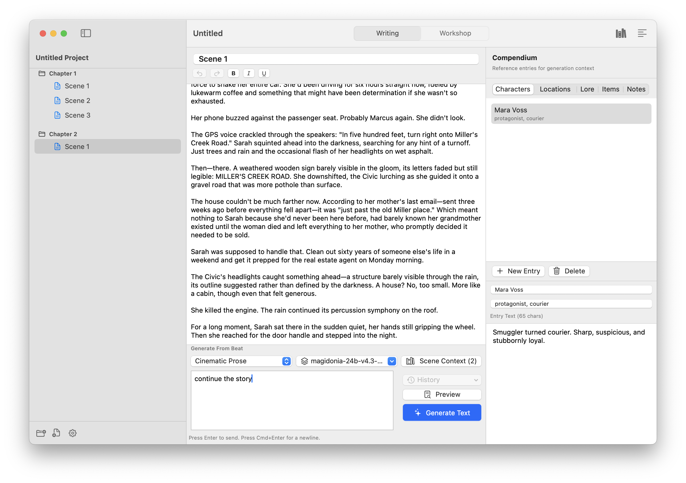

# Scene


`Scene` is a standalone SwiftUI based macOS book writing tool, focused on AI text generation.



## Features

- Binder-style chapter and scene navigation with reordering.
- Rich text scene editor with bold/italic/underline formatting and keyboard shortcuts.
- AI prose generation from story beats with streaming, cancellation, payload preview, and token usage stats.
- AI rewrite actions (rewrite/expand/shorten) on selected text via prompt templates.
- Scene and chapter summary workflows with editable summaries and streaming updates.
- Compendium with categories (characters, locations, lore, items, notes).
- Scene-local context selection using compendium entries, scene summaries, and chapter summaries.
- Mention-based context injection in beat/chat inputs via `@tags` and `#scenes` with autocomplete.
- Workshop chat with multi-session history, markdown rendering, inline message actions, and usage metrics.
- Provider support: OpenAI, Anthropic, OpenRouter, LM Studio (local), and custom OpenAI-compatible endpoints.
- Project-local settings for AI provider, prompt templates, and autosave.
- Data exchange for prompts, compendium, and projects, plus plain text and HTML project export.
- Native document workflow with `.sceneproj` project bundles.

## Requirements

- macOS 14 or newer
- Swift 6 toolchain (`swift --version`) or Xcode 15.4+
- XcodeGen (`brew install xcodegen`) for the autonomous GUI build script

## Project Structure

```text
Scene/
├─ Package.swift
├─ project.yml
├─ README.md
├─ scripts/
│  └─ build-gui-app.sh
├─ Resources/
└─ Sources/SceneApp/
   ├─ SceneApp.swift
   ├─ Models/
   │  ├─ DomainModels.swift
   │  └─ GenerationModels.swift
   ├─ Services/
   │  ├─ AIService.swift
   │  ├─ OpenAICompatibleAIService.swift
   │  └─ PersistenceService.swift
   ├─ Utilities/
   │  ├─ MentionParsing.swift
   │  └─ ProjectDialogs.swift
   ├─ Store/
   │  └─ AppStore.swift
   └─ Views/
      ├─ SceneFileCommands.swift
      ├─ ProjectMenuActions.swift
      ├─ ContentView.swift
      ├─ BinderSidebarView.swift
      ├─ EditorView.swift
      ├─ SceneSummaryPanelView.swift
      ├─ CompendiumView.swift
      ├─ WorkshopChatView.swift
      ├─ MentionAutocompleteListView.swift
      └─ SettingsSheetView.swift
```

### Module Roles

- `Models/`: Codable domain objects (project, scenes, compendium, prompts, workshop sessions) and generation request/response models.
- `Services/`: persistence and provider-specific AI integration.
- `Utilities/`: shared helpers for native dialogs and mention parsing/autocomplete state.
- `Store/AppStore.swift`: central app state, mutations, selection logic, and async generation/chat workflows.
- `Views/`: SwiftUI UI composition for writing workspace, summary panel, compendium, workshop, settings, and app/file commands.

## Build

Run commands from the `Scene` project directory.

```bash
swift build
```

## Run (Development)

```bash
swift run SceneApp
```

## Install

### Option 1: Install via Xcode (recommended for GUI app distribution)

1. Open `Package.swift` in Xcode.
2. Select the `SceneApp` scheme and run once (`Product > Run`).
3. For a distributable app, use `Product > Archive` and then `Distribute App`.
4. Place the generated app in `/Applications` (or `~/Applications`).

### Option 2: Local release executable via SwiftPM

```bash
swift build -c release
```

Binary path:

```text
.build/release/SceneApp
```

You can run this executable directly from Terminal.

### Option 3: Autonomous `.app` build (XcodeGen + xcodebuild)

Generate and build the macOS app bundle in one command:

```bash
./scripts/build-gui-app.sh
```

Output bundle:

```text
dist/SceneApp.app
```

Script options:

```bash
./scripts/build-gui-app.sh --debug
./scripts/build-gui-app.sh --clean --release
```

## Data & Configuration

- Projects are stored as folder bundles with `.sceneproj` extension.
- Each project contains:
  - `manifest.json` (ordering, metadata, settings)
  - `scenes/*.rtf` (scene text with optional rich text formatting)
  - `compendium/*.md` (entry text)
  - `workshop/*.json` (chat messages)
- The app restores the last opened project on restart.
- Project Settings -> General includes `Autosave project changes` (enabled by default).
- Supported providers: `OpenAI (ChatGPT)`, `Anthropic (Claude)`, `OpenRouter`, `LM Studio (Local)`, and `OpenAI-Compatible (Custom)`.
- Configure provider settings in Project Settings:
  - endpoint URL (auto-populated with provider default)
  - API key
  - model name
  - optional model discovery (`Refresh`)
  - streaming mode
  - request timeout (default: 5 minutes)

## Import & Export

- `File -> Import -> Project JSON...` imports a full project snapshot from JSON.
- `File -> Export -> Project JSON...` exports the full project as a single JSON file.
- `File -> Export -> Project Plain Text...` exports as one `.txt` file in chapter/scene order.
- `File -> Export -> Project HTML...` exports as one `.html` file with semantic headings and paragraphs.
- Project Settings -> General -> Data Exchange also provides:
  - prompt template export/import
  - compendium export/import
  - project JSON export/import
- Prompt export includes:
  - all custom templates
  - built-in templates only when they were modified
- Prompt import updates built-in templates by ID when present, and adds non-built-in templates with duplicate-safe naming.

## Scene Context Behavior

- Scene context selection is scene-local and persisted in project data.
- Scene context can include three source types:
  - compendium entries
  - scene summaries
  - chapter summaries
- Context selection is used by prose generation, rewrite, summary generation, and workshop chat when context usage is enabled.
- Context selection no longer applies hard caps on:
  - number of selected entries
  - per-entry context text length

## Recent Changes

- Added `File` menu Import/Export submenus with native dialogs.
- Enabled project JSON import even when no project content is currently open.
- Added single-file project export formats for plain text and HTML.
- Added prompt/compendium/project data exchange controls in Project Settings.
- Updated prompt export/import to preserve modified built-in templates.
- Added persistent scene-local context selection for scene summaries and chapter summaries.
- Extended Scene Context sheet with searchable multi-source selection (compendium + scene summaries + chapter summaries).
- Removed hardcoded compendium context truncation and count restrictions in Swift context construction.
- Added chapter-level summary workflow (from scene summaries) alongside scene-level summaries.
- Added streaming support, live token usage reporting, inline workshop message actions, and improved auto-scroll behavior in workshop chat.
- Added rich text editor support in the writing panel (bold/italic/underline + keyboard shortcuts).
- Added structured prompt rendering with canonical `{{variable}}` and `{{function(...)}}` syntax (legacy `{variable}` remains supported), plus template warnings in payload previews.

## Prompt Template Variables

Prompt templates support canonical syntax:

- `{{variable}}`
- `{{function(arg=value)}}`

Legacy placeholders like `{beat}` remain supported for compatibility.

Common variables:

- `{{beat}}`
- `{{selection}}`
- `{{scene}}`
- `{{scene_title}}`
- `{{chapter_title}}`
- `{{project_title}}`
- `{{context}}`
- `{{context_compendium}}`
- `{{context_scene_summaries}}`
- `{{context_chapter_summaries}}`
- `{{conversation}}`
- `{{chat_name}}`
- `{{last_user_message}}`
- `{{last_assistant_message}}`
- `{{summary_scope}}`
- `{{source}}`

Built-in functions:

- `{{scene_tail(chars=4500)}}`
- `{{chat_history(turns=8)}}`
- `{{context(max_chars=4000)}}`
- `{{context_compendium(max_chars=4000)}}`
- `{{context_scene_summaries(max_chars=4000)}}`
- `{{context_chapter_summaries(max_chars=4000)}}`
