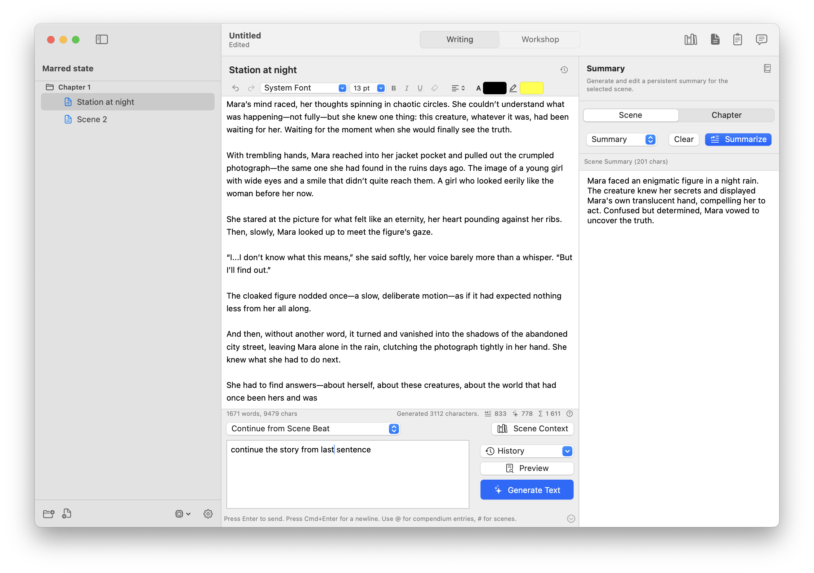
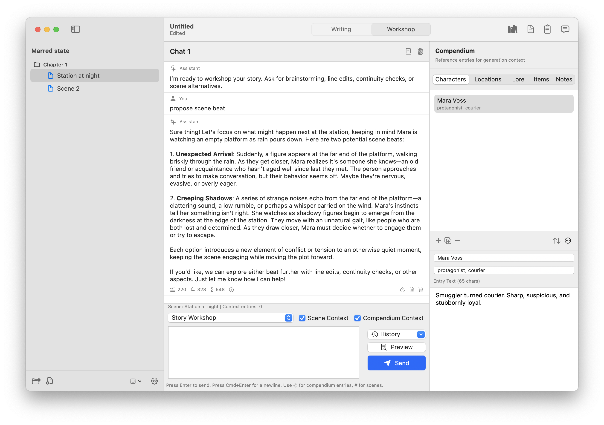

# Scene

`Scene` is a native macOS writing application built with SwiftUI for crafting book-length prose. It combines a rich text editor, binder-style chapter/scene organization, and a world-building compendium with deep AI integration — prose generation from story beats, inline rewriting, workshop chat for brainstorming, rolling memory for long-context consistency, and customizable prompt templates. Projects are self-contained `.sceneproj` bundles with built-in checkpoints, EPUB/JSON/HTML export, and support for OpenAI, Anthropic, OpenRouter, LM Studio, and custom API endpoints. Zero external dependencies.





## Features

- Binder-style chapter and scene navigation with reordering.
- Rich text scene editor with font family/size controls, bold/italic/underline stateful toggles, text/highlight color, alignment, and clear-format action.
- AI prose generation from story beats with streaming, cancellation, payload preview, and token usage stats.
- AI rewrite actions (rewrite/expand/shorten) on selected text via prompt templates, with optional incremental rewrite streaming.
- Streaming generation/rewrite updates are coalesced into a single undo step per run.
- Collapsible text-generation form in the writing panel, with persistent visibility state and quick re-focus actions.
- Scene and chapter summary workflows with editable summaries and streaming updates.
- Compendium with categories (characters, locations, lore, items, notes).
- Scene-local context selection using compendium entries, scene summaries, and chapter summaries.
- Mention-based context injection in beat/chat inputs via `@tags` (including compendium entry titles) and `#scenes` with autocomplete.
- Workshop chat with multi-session history, markdown rendering, inline message actions, and usage metrics.
- Persistent prompt history for workshop input (per conversation) and beat input (per scene), with trimming/deduplication and a 30-entry cap.
- Rolling memory for workshop sessions, chapters, and scenes, with editable memory sheets in chat and summary headers.
- `View` menu keyboard shortcuts for binder/workspace/panel toggles (`Cmd-1` through `Cmd-8`) plus quick switch/focus to text generation (`Cmd-K`).
- Native Help menu integration with a bundled `Scene Help` book (topics for shortcuts, generation, rolling memory, and prompts).
- Project checkpoints with selective restore scope/behavior and scene-level history browsing (diff + text-only restore).
- Provider support: OpenAI, Anthropic, OpenRouter, LM Studio (local), and custom OpenAI-compatible endpoints.
- Project-local settings for AI provider, prompt templates, text generation behavior, and autosave.
- Standard project metadata fields (author/language/publisher/rights/description) in Project Settings.
- Data exchange for prompts, compendium, and projects, plus plain text, HTML, and EPUB project export/import.
- Native document workflow with `.sceneproj` project bundles.

## Requirements

- macOS 14 or newer
- Swift 6 toolchain (`swift --version`) or Xcode 15.4+
- XcodeGen (`brew install xcodegen`) for the autonomous GUI build script

## Project Structure

```text
Scene/
├─ Package.swift
├─ project.yml
├─ README.md
├─ scripts/
│  ├─ build-gui-app.sh
│  └─ flush-help-cache.sh
├─ Resources/
└─ Sources/SceneApp/
   ├─ SceneApp.swift
   ├─ Models/
   │  ├─ DomainModels.swift
   │  └─ GenerationModels.swift
   ├─ Services/
   │  ├─ AIService.swift
   │  ├─ OpenAICompatibleAIService.swift
   │  └─ PersistenceService.swift
   ├─ Utilities/
   │  ├─ MentionParsing.swift
   │  └─ ProjectDialogs.swift
   ├─ Store/
   │  └─ AppStore.swift
   └─ Views/
      ├─ SceneFileCommands.swift
      ├─ ViewMenuActions.swift
      ├─ ProjectMenuActions.swift
      ├─ ContentView.swift
      ├─ BinderSidebarView.swift
      ├─ EditorView.swift
      ├─ SceneSummaryPanelView.swift
      ├─ CompendiumView.swift
      ├─ WorkshopChatView.swift
      ├─ MentionAutocompleteListView.swift
      └─ SettingsSheetView.swift
```

### Module Roles

- `Models/`: Codable domain objects (project, scenes, compendium, prompts, workshop sessions) and generation request/response models.
- `Services/`: persistence and provider-specific AI integration.
- `Utilities/`: shared helpers for native dialogs and mention parsing/autocomplete state.
- `Store/AppStore.swift`: central app state, mutations, selection logic, and async generation/chat workflows.
- `Views/`: SwiftUI UI composition for writing workspace, summary panel, compendium, workshop, settings, and app/file commands.

## Build

Run commands from the `Scene` project directory.

```bash
swift build
```

## Run (Development)

```bash
swift run SceneApp
```

## Install

### Option 1: Install via Xcode (recommended for GUI app distribution)

1. Open `Package.swift` in Xcode.
2. Select the `SceneApp` scheme and run once (`Product > Run`).
3. For a distributable app, use `Product > Archive` and then `Distribute App`.
4. Place the generated app in `/Applications` (or `~/Applications`).

### Option 2: Local release executable via SwiftPM

```bash
swift build -c release
```

Binary path:

```text
.build/release/SceneApp
```

You can run this executable directly from Terminal.

### Option 3: Autonomous `.app` build (XcodeGen + xcodebuild)

Generate and build the macOS app bundle in one command:

```bash
./scripts/build-gui-app.sh
```

Output bundle:

```text
dist/SceneApp.app
```

Script options:

```bash
./scripts/build-gui-app.sh --debug
./scripts/build-gui-app.sh --clean --release
```

## Help System

The app includes a bundled Apple Help book (`Resources/SceneHelp.help/`) that integrates with the macOS Help menu. The help index must be rebuilt whenever help content changes.

### Rebuilding help after editing content

```bash
# Rebuild the .cshelpindex from the HTML sources
hiutil -I corespotlight -Caf \
  Resources/SceneHelp.help/Contents/Resources/en.lproj/search.cshelpindex \
  Resources/SceneHelp.help/Contents/Resources/en.lproj/
```

The build script (`build-gui-app.sh`) runs this automatically before each build.

### Flushing the help cache

macOS caches help book content aggressively via the `helpd` and `tipsd` daemons (macOS 15 routes help through the Tips app). After rebuilding the app with updated help pages, run:

```bash
./scripts/flush-help-cache.sh
```

Then relaunch the app. Without this step, the Help viewer will continue showing stale content.

### Help book structure notes

- HTML anchors must use `<a name="...">` (not `<a id="...">`) for `NSHelpManager.openHelpAnchor` to resolve them.
- The search index must be `.cshelpindex` format (created with `hiutil -I corespotlight`), not the legacy `.helpindex`.
- The help bundle's `Info.plist` must include `HPDBookCSIndexPath`, `HPDBookType`, and `CFBundleSignature` alongside `HPDBookTitle` and `HPDBookAccessPath`.
- The built app must be ad-hoc signed (`codesign --force --deep --sign -`) for `NSHelpManager.registerBooks` to succeed on macOS 15+.

## Data & Configuration

- Projects are stored as folder bundles with `.sceneproj` extension.
- Each project contains:
  - `manifest.json` (ordering, metadata, settings)
  - `scenes/*.rtf` (scene text with optional rich text formatting)
  - `compendium/*.md` (entry text)
  - `workshop/*.json` (chat messages)
- The app restores the last opened project on restart, including the last selected scene for that project.
- Project Settings -> General includes `Autosave project changes` (enabled by default) and project metadata fields.
- Project Settings -> Text Generation includes multi-model selection, inline generation toggle, rewrite behavior toggles, and task-notification controls.
- Supported providers: `OpenAI (ChatGPT)`, `Anthropic (Claude)`, `OpenRouter`, `LM Studio (Local)`, and `OpenAI-Compatible (Custom)`.
- Configure provider settings in Project Settings:
  - endpoint URL (auto-populated with provider default)
  - API key
  - model name
  - optional model discovery (`Refresh`)
  - streaming mode
  - request timeout (default: 5 minutes)

## Import & Export

- `File -> Import -> Project JSON...` imports from JSON into a new `.sceneproj` and opens it in a new window.
- `File -> Import -> Project EPUB...` imports from EPUB into a new `.sceneproj` and opens it in a new window.
- `File -> Export -> Project JSON...` exports the full project as a single JSON file.
- `File -> Export -> Project Plain Text...` exports as one `.txt` file in chapter/scene order.
- `File -> Export -> Project HTML...` exports as one `.html` file with semantic headings and paragraphs.
- `File -> Export -> Project EPUB...` exports as `.epub` and embeds Scene project payload for round-trip Scene import.
- Project metadata (author/language/publisher/rights/description) is persisted in project JSON and mapped to EPUB OPF metadata fields on export/import.
- `File -> Project Settings...` opens Project Settings from the menu.
- Project Settings -> General -> Data Exchange also provides:
  - prompt template export/import
  - compendium export/import
  - project JSON export/import (replace current project)
  - project EPUB export/import (replace current project)
- Prompt export includes:
  - all custom templates
  - built-in templates only when they were modified
- Prompt import updates built-in templates by ID when present, and adds non-built-in templates with duplicate-safe naming.

## Scene Context Behavior

- Scene context selection is scene-local and persisted in project data.
- Scene context can include three source types:
  - compendium entries
  - scene summaries
  - chapter summaries
- Context selection is used by prose generation, rewrite, summary generation, and workshop chat when context usage is enabled.
- In workshop chat, explicit `@...`/`#...` mentions are still resolved even when `Compendium Context` is disabled.
- Context selection no longer applies hard caps on:
  - number of selected entries
  - per-entry context text length

## Rolling Memory

- Workshop rolling memory is conversation-local (per workshop session).
- Chapter rolling memory is chapter-local.
- Scene rolling memory is scene-local and validated against scene content hash.
- Workshop memory refreshes automatically in background after enough new turns, and can be edited from the workshop header (`book` icon).
- Chapter memory can be edited from the Summary panel in chapter scope (`book` icon), with an `Update...` menu:
  - chapter summary text
  - chapter text up to the currently selected scene
  - full chapter text
- During iterative chapter-memory refresh from scene text, the chapter memory sheet updates live after each scene merge step (when the sheet is open).
- Scene memory can be edited from the Summary panel in scene scope (`book` icon), with an `Update...` menu:
  - scene summary text
  - full scene text
- Rolling memory is available in prompt rendering via `{{context_rolling}}`/`{{rolling_summary}}`, and included in `{{context}}`.

## Recent Changes

- Added persistent per-conversation workshop input history and per-scene beat input history (trimmed, deduplicated, capped to 30).
- Added timestamped project checkpoints with selective restore scope and restore behavior toggles.
- Added per-scene history viewer (with diff against current scene) and scene-text-only restore from checkpoint.
- Added `Checkpoints -> Scene History` menu command and editor-header scene history action.
- Added dedicated `Project Settings -> Text Generation` tab and moved rewrite/multi-model controls there.
- Added project metadata editing in `Project Settings -> General` and EPUB metadata mapping on export/import.
- Added `View` menu commands and keybindings:
  - `Cmd-1` toggle binder
  - `Cmd-2` switch to writing (focuses main editor)
  - `Cmd-3` switch to workshop (focuses chat input)
  - `Cmd-4` toggle compendium
  - `Cmd-5` toggle summary
  - `Cmd-6` toggle notes
  - `Cmd-7` toggle conversations
  - `Cmd-8` toggle text generation (opens and focuses generation input when showing)
  - `Cmd-K` switch to text generation / focus story beat input
- Added `View -> Switch to Text Generation` command and aligned `Cmd-K`/`Cmd-8` to always focus the generation input when the form is shown.
- Added writing-panel generation form collapse/restore buttons (bottom-right) with persistent visibility state per window session.
- Added project-configurable task toast notifications for generation/summarization/memory background tasks and cancellation outcomes.
- Added standard app help infrastructure: bundled Help Book metadata/resources plus Help menu topic entries.
- Updated workshop context behavior so explicit `@`/`#` mentions are included even when `Compendium Context` is disabled.
- Extended `@` mention matching to recognize compendium entry titles in addition to explicit entry tags.
- Persisted and restored the currently selected scene across app restart/reopen.
- Added `File` menu Import/Export submenus with native dialogs.
- Enabled project JSON import even when no project content is currently open.
- Added single-file project export formats for plain text and HTML.
- Added EPUB project export/import with embedded Scene payload for robust Scene-to-Scene transfer.
- Updated `File -> Import` flows to create and open a new project window instead of replacing the current document.
- Added `File -> Project Settings...` command.
- Added prompt/compendium/project data exchange controls in Project Settings.
- Updated prompt export/import to preserve modified built-in templates.
- Added persistent scene-local context selection for scene summaries and chapter summaries.
- Extended Scene Context sheet with searchable multi-source selection (compendium + scene summaries + chapter summaries).
- Removed hardcoded compendium context truncation and count restrictions in Swift context construction.
- Added chapter-level summary workflow (from scene summaries) alongside scene-level summaries.
- Added streaming support, live token usage reporting, inline workshop message actions, and improved auto-scroll behavior in workshop chat.
- Added rich text editor support in the writing panel (bold/italic/underline + keyboard shortcuts).
- Added richer text formatting controls (font family/size split controls, color/highlight controls, clear formatting action).
- Added incremental rewrite streaming option and consolidated undo history for streaming generation/rewrite.
- Added rolling memory model/persistence and prompt integration (`context_rolling`, `rolling_*` variables).
- Added workshop rolling memory editor sheet in the chat header and scene/chapter rolling memory sheets in the Summary header.
- Added rolling memory refresh actions from scene/chapter summary text, full scene/chapter text, and chapter text up to selected scene.
- Hardened model discovery refresh to remove stale unavailable models from active configuration and menus.
- Added structured prompt rendering with canonical `{{variable}}` and `{{function(...)}}` syntax (legacy `{variable}` remains supported), plus template warnings in payload previews.

## Prompt Template Variables

Prompt templates support canonical syntax:

- `{{variable}}`
- `{{function(arg=value)}}`

Legacy placeholders like `{beat}` remain supported for compatibility.

Common variables:

- `{{beat}}`: current beat input text (generation/rewrite prompt input).
- `{{selection}}`: currently selected editor text (rewrite-focused templates).
- `{{selection_context}}`: local before/after context around selected text (rewrite templates).
- `{{scene}}`: current scene excerpt/body used for prompting.
- `{{scene_title}}`: selected scene title (fallbacks to untitled label).
- `{{chapter_title}}`: selected chapter title.
- `{{project_title}}`: current project title.
- `{{context}}`: merged context from selected compendium entries + selected scene/chapter summaries.
- `{{context_rolling}}`: merged rolling memory block (workshop + chapter + scene when available).
- `{{rolling_summary}}`: alias of `{{context_rolling}}`.
- `{{context_compendium}}`: compendium-only context block.
- `{{context_scene_summaries}}`: scene-summary-only context block.
- `{{context_chapter_summaries}}`: chapter-summary-only context block.
- `{{rolling_workshop_summary}}`: workshop/session rolling memory only.
- `{{rolling_chapter_summary}}`: chapter rolling memory only.
- `{{rolling_scene_summary}}`: scene rolling memory only.
- `{{conversation}}`: workshop transcript text context.
- `{{chat_name}}`: active workshop chat/session name.
- `{{last_user_message}}`: latest user message in workshop session.
- `{{last_assistant_message}}`: latest assistant message in workshop session.
- `{{summary_scope}}`: summary mode label (scene/chapter) when summary templates are rendered.
- `{{source}}`: primary source text used by the current template category.

Built-in functions:

- `{{scene_tail(chars=2400)}}`
- `{{chat_history(turns=8)}}`
- `{{context(max_chars=4000)}}`
- `{{context_rolling(max_chars=2200)}}`
- `{{rolling_summary(max_chars=2200)}}`
- `{{context_compendium(max_chars=4000)}}`
- `{{context_scene_summaries(max_chars=4000)}}`
- `{{context_chapter_summaries(max_chars=4000)}}`
